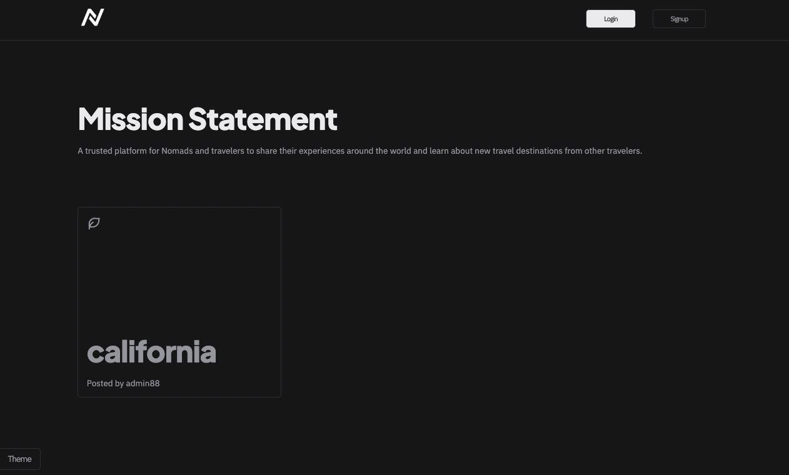
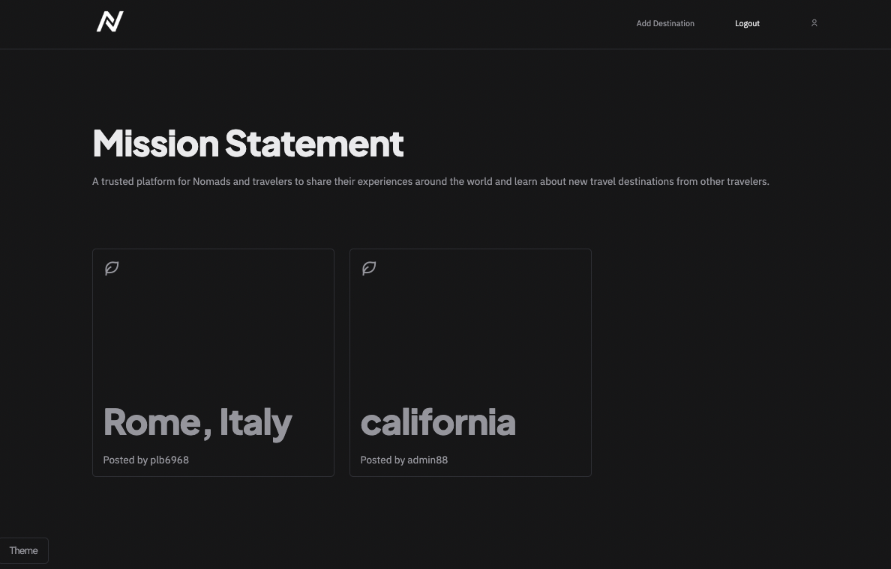
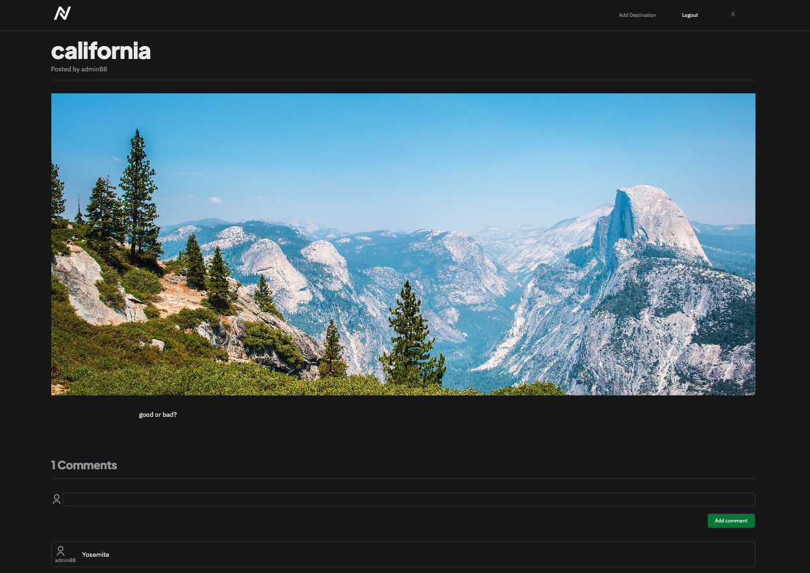

# NOMADLAND

## MISSION STATEMENT
A trusted platform for  Nomads and travelers to share their experiences around the world and learn about new travel destinations from other travelers.

## HOW TO USE
After clicking the link below, you will come to Nomadland's landing page.  If you are a new user you will be prompted to Sign up.  If you've previously signed up, you will need to log in using your previously created UserId and Password.

Once you've either logged in our signed up, you will be able to browse through all posts.

When creating a new post, you will be able to add the name of the place, add an image and a description of a recently visited places. Other users will be able to comment on your post.

## Technologies Used

## Getting Started

Link:
https://nomadland.herokuapp.com/

Trello:
https://trello.com/b/vaHaPb3M/nomadland

Pitch Deck:
https://docs.google.com/presentation/d/13gV1RtYa7aW2cLHhX8setNecV0K2YCMxts6SExo_c4w/edit#slide=id.p

## Next Steps

